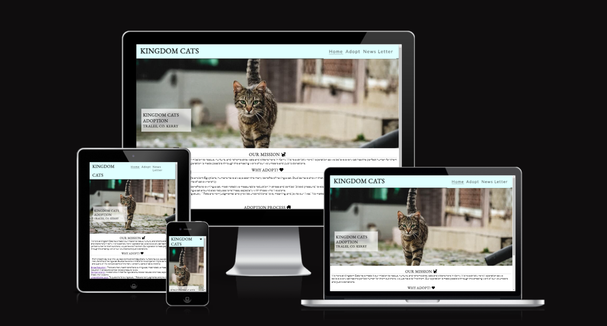
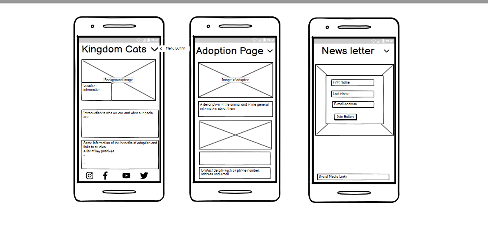
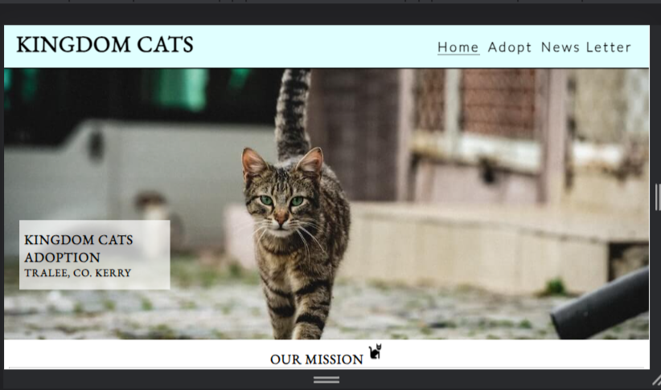
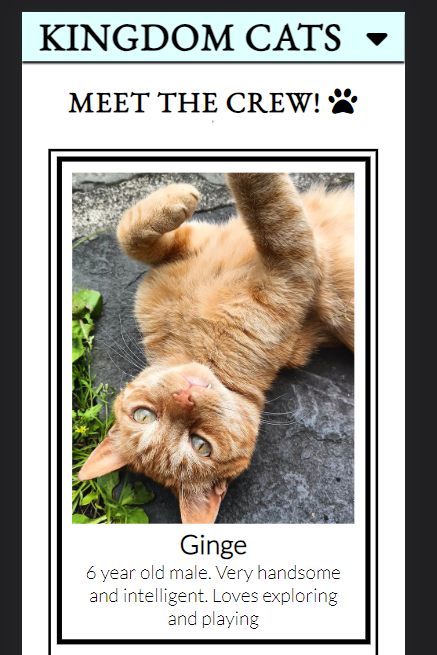
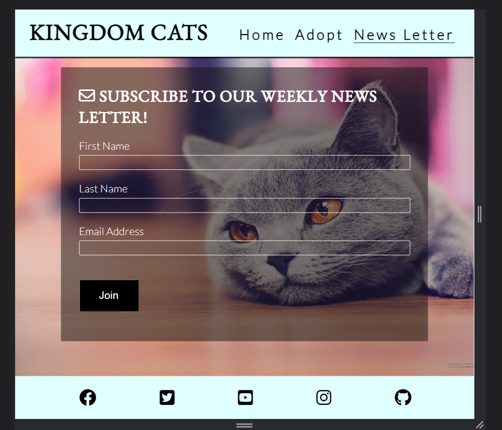
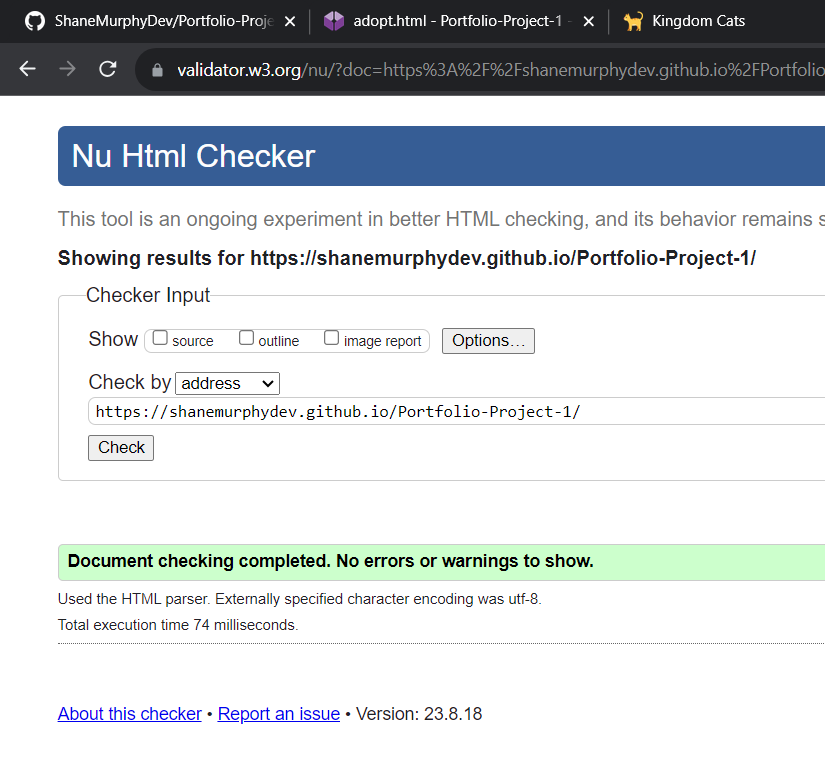

<h1>Kingdom Cats</h1>
Kingdom Cats is a website for adopting and fostering cats and kittens that need a home. I choose this because it's something i'm passionate about. The goal to create an easy to use and easy to understand website for those interested in adoption. Kingdom Cats will be ideal for people living in Co Kerry and include a gallery with adoptees, information about them, abd all of our contact information incase they decide to adopt.

<h2>Features</h2>
Navigation bar.
Home page includes logo and a drop down toggle menu for ease of access to the other pages on the site. Home, Adopt, and a page to sign up tp out news letter

The home page will include information on the motivation of the site and include some studies on the benefits of adoption
This will include a well laid out list in the Why adopt section

<h2>The Footer</h2>
The footer will include links to the relevant social media, this will encourage viewers to check us out on other platforms and share adoptees profiles

<h2> Adoption Page </h2>
This section will include pictures of the cats we have available to adopt and a brief decription about them, such as age and personality.

<h2> News Letter </h2>
This page will allow the viewer to sign up via email to our news letter so we can keep in touch with those interested in adoptions and provide them with weekly updates on new adoptees.
A thank you page will be included to keep them onsite.

<h2>Testing</2>
I have conducted thourough testing via the browser inspect and dev tools. This includes test the site on different screen sizes such as phones, tablets, laptops, and so on. Im very happy with how well everything works. Ran nito some issues with the adopt page images lining up and sizing correctly. After much experimentation im happy with the way it ended up.

Performances scores on light house: 

Validator Testing
HTML:

CSS:

Unfixed bugs - There is are bug where the text ajoining a gallery image doesnt stay together, i've tried recreating it to understand whats happening and i believe it's due to the seperation of divs

Deployment
The site was deployed to GitHub pages, the steps are as follows:
In the GitHub repository, navigate to the Settings tab
From the source section drop-down menu, select the Master Branch
Once the master branch has been selected, the page will be automatically refreshed with a detailed ribbon display to indicate the successful deployment

Live link can be found here: <https://github.com/ShaneMurphyDev/Portfolio-Project-1

Credits
Content:
The icons used in this project are from: <https://fontawesome.com

Followed this guide to help make the adoption gallery:
<https://www.udacity.com/blog/2021/06/the-easy-guide-to-building-a-css-image-gallery.html

Media:
The photos used in this project are from: <https://pixabay.com
